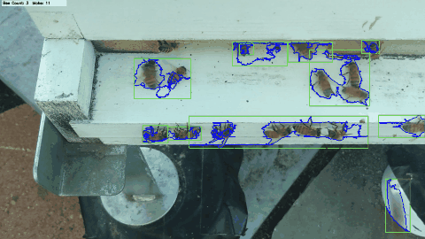
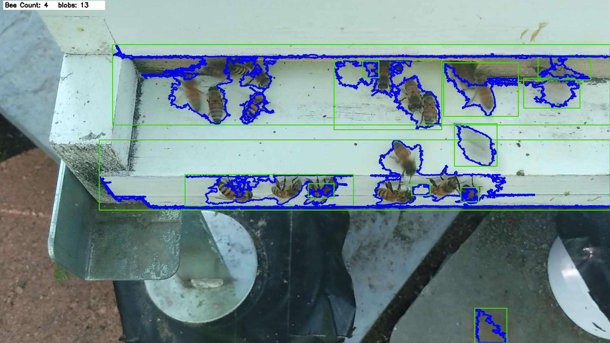
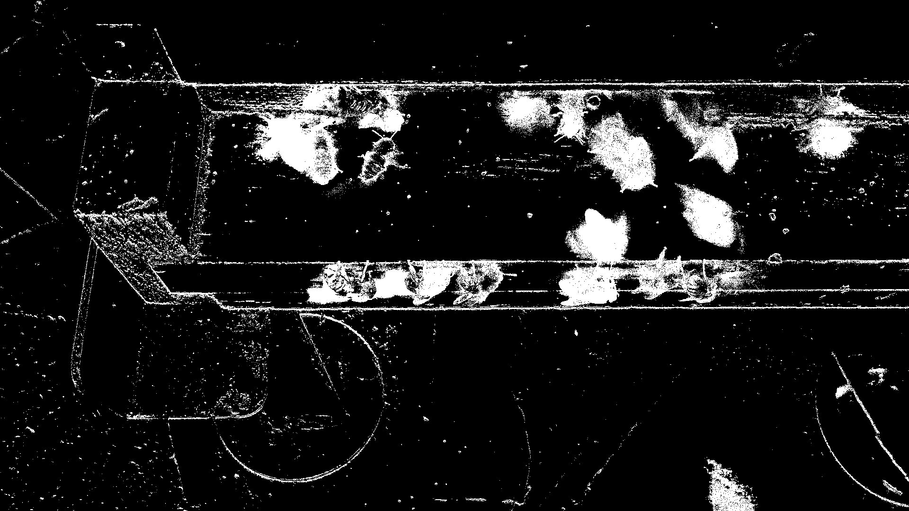

# BeeProject

Counting honeybees at a hive entrance from video, to monitor colony health without opening the hive.

Research at Rutgers WINLAB / Liberty Science Center Partners in Science, 2022. Colony Collapse Disorder has pushed bee mortality to roughly 30% a year with no confirmed cause, so cheap continuous monitoring matters.



## How it works

- **KNN background subtraction** separates moving bees from the static hive box — no labelled data, no training.
- **Contour filtering** drops blobs under 1100 px², removing sensor noise and hive shadows.
- **Area-based counting** divides total contour area by a per-bee constant rather than counting blobs, so bees overlapping at the entrance still count separately.
- **Audio frequency analysis** identifies orientation flights and distinguishes hive types, supplementing the vision count.
- **Local outlier factor** flags anomalous hive states and alerts the caretaker.
- **91% accuracy** on the computer-vision population metric.
- Over 619 frames of the sample clip: mean 3.5 bees, peak 9.

Trade-off worth naming: area-based counting handles overlap but assumes roughly constant apparent bee size, so it drifts if camera distance changes.

## Demo



Contours in blue, bounding boxes in green, live count overlaid.



The foreground mask the count is derived from.

## Paper

[Agricultural Monitoring of Beehive Health](docs/beehive-health-paper.pdf) — Rutgers WINLAB, August 2022.

## Run it

```bash
pip install opencv-python
python BeeDetection.py     # expects bee1short.mp4 alongside
```
